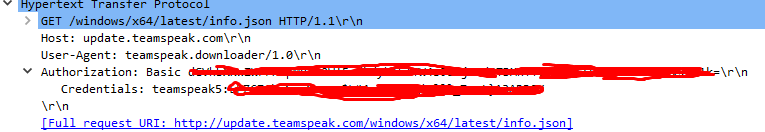
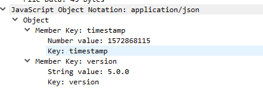
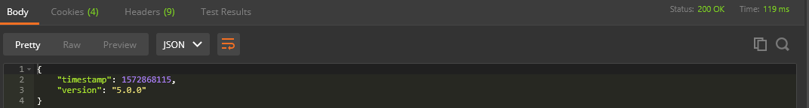
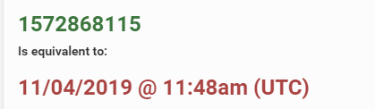
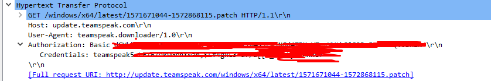
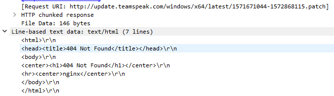
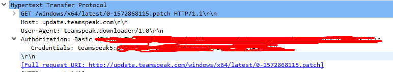
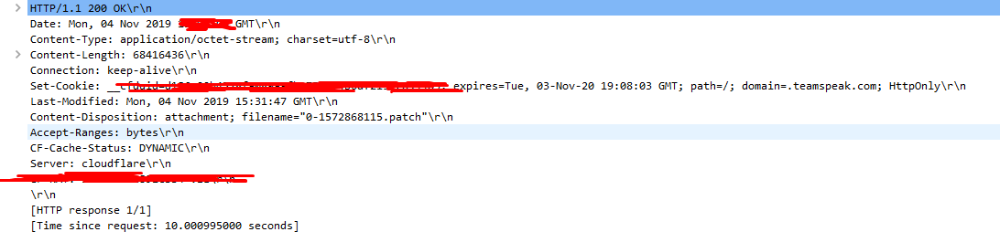

Before I updated to new version of TS5 beta 5.0.0-beta.12 I launched Wireshark to see what happens when users run update.

When users hits 'Check for Updates', TS5 client sends GET request to http://update.teamspeak.com/windows/x64/latest/info.json
This link probably variates from OS to OS.
If we go to this link trough browser we will get 403 forbidden access.

But if we look in wireshark, this request contains some headers.
That headers are:

Basicly they are asking webserver which is newest version, but soon we will get into this.
To replicate this request we need to send User-Agent, and this basic autherization. But this part I dont understand, what represents this login, probably default for every user and this password or some unique id for user which sends this request.

Soon we are reciving response from webserver:

From postman:

From here we can see that webserver responds in json,
We have two fields, one is version and that almost doesnt change at all from all this versions.

Other one is timestamp which is unix timestamp. This represents when new version is published (not sure but it seems logic), and client now compares unix timestap which was download before with this new one. If check doesnt match user continues with update, or if match is good TS5 client renders 'TeamSpeak is up-to-date'.
This timestamp is equal to:

If update is required client sends new request to webserver:

Again same headers are sent, but this time clients wants this file with combined timestamps (old-new.patch)
Server responds in html:

From text above we can see that this file doesnt exists, so it failed. Maybe this is feature for fast bug fix or something like that.

After this clients continues with requests:

Now client requests for file with this timestamp, but with prefix 0- which represents something to them like versioning.
After this webserver sends file to client if all headers are good.
When file download is done weservers response is 200 OK

I didnt have time to make full request to download this file and see its content but later I will.
Also this leaves us possibility to bruteforce user download directory for pre-release versions, only if they dont have own type of checking lol.

