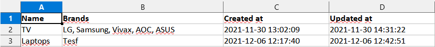

Of current 2.6 version of Twill CMS provides an easy way to enable quick actions on tables. You can do that on a module controller like this:

```php

public function additionalTableActions()
{
    return [
        'exportAction' => [ // Action name.
            'name' => 'Export Newsletter List', // Button action title.
            'variant' => 'primary', // Button style variant. Available variants; primary, secondary, action, editor, validate, aslink, aslink-grey, warning, ghost, outline, tertiary
            'size' => 'small', // Button size. Available sizes; small
            'link' => route('newsletter.export'), // Button action link.
            'target' => '', // Leave it blank for self.
            'type' => 'a', // Leave it blank for "button".
        ]
    ];
}
```

This really provides a quick and nice way to trigger some action (or redirect), and from my usage, this was enough to start. 
The problem came later, since users wanted to select a specific range of exported data, and this, unfortunately, didn't provide a request.

Note: with this method, you also can make usage of route params passing if your parameters are static.

You will need to make a custom controller for this exporter.
```php
public function additionalTableActions()
{
    return [
        'exportAction' => [ // Action name.
            'name' => 'Export Newsletter List', // Button action title.
            'variant' => 'primary', // Button style variant. Available variants; primary, secondary, action, editor, validate, aslink, aslink-grey, warning, ghost, outline, tertiary
            'size' => 'small', // Button size. Available sizes; small
            'link' => route('newsletter.export', ['order' => 'ASC', 'emails' => 'yes']);, // Button action link.
            'target' => '', // Leave it blank for self.
            'type' => 'a', // Leave it blank for "button".
        ]
    ];
}
```

### How do custom pages work? 

From [docs](https://twill.io/docs/custom-cms-pages/) we can see that custom pages on Twill are piece of cake.

Firstly, let's generate a controller in `Admin`.

`php artisan make:controller "Admin/ExportController"`

This will generate the default Laravel controller, but we will need to overwrite it.

```php
namespace App\Http\Controllers\Admin;

class ExportController
{
    public function show()
    {
        ...
    }
}
```

After overwriting the controller we are provided with `show()` method which is able to return a specific view file for a custom page.

```php
public function show()
{
    return view('admin.custom.export');
}
```

Now let's create that blade file.

```sh
$ cd ./resources/views/admin/custom
$ touch export.blade.php
```

`export.blade.php`

```html
@extends('twill::layouts.free')

@section('customPageContent')

    <a17-fieldset title="Categories" id="type" :open="false">
        <form method="POST" action="{{route('admin.exportsSubmit')}}">

            @csrf
            
            <div class="wrapper">
                <div class="col--double col--double-wrap">
                    <a17-inputframe label="Start date" note="Starting date range">
                        <a17-datepicker enableTime="true" name="minDate"></a17-datepicker>
                    </a17-inputframe>
                </div>
                <div class="col--double col--double-wrap">
                    <a17-inputframe label="End date" note="End date range">
                        <a17-datepicker enableTime="true" name="maxDate"></a17-datepicker>
                    </a17-inputframe>
                </div>
            </div>
                
            <br>

            <a17-button variant="validate" name="submit" type="submit" value="Categories">Generate</a17-button>
        </form>
    </a17-fieldset>


    ...

@stop

```

In this blade file, we used Twill blade components and we passed some props, regarding what component accepts.

The form also includes 2 date pickers which allow us to select specific ranges. The date picker accepts range prop, but it seems that is not working so I went with two date pickers.

Also to note we used native HTML elements like `form` here to make a working form that will submit POST requests to the specific endpoint. 

```php 
route('admin.exportsSubmit') 
```

Let's register routes in `routes/admin.php`

```php
/**
 * Custom CMS pages
 */

Route::name('exports')->get('/export', 'ExportController@show');
Route::name('exportsSubmit')->post('/export', 'ExportController@exportData');
```

After this, you should be able to access it on the URL
`twill.test/{handle}/export`

To easily navigate to this page we have two easy options.

The first is to register this route in `config/twill-navigation.php`

```php
return [
    'exportPage' => [
        'title' => 'Export',
        'route' => 'admin.export',
    ],
];
```

Make sure that you have named the GET route in `admin.php` for showing this page.

Now lets create `exportData` method on `ExportController`.


```php
/**
 * Handle incoming POST requests from the form
 *
 * @param Request $request
 * @return void
 */
public function exportData(Request $request)
{

    try {

        // Operation requested from admin
        $operation = $request->input('submit');

        // Define static file class namespace
        $exportclass = '\App\Exports\\' . $operation;

        // Check if we have generate action
        $exportclass .= 'Export';

        // Resolve export class (dynamicly)
        return new $exportclass($request->input('minDate'), $request->input('maxDate'));

        //Self-explanatory
        die('You should not be here. Refresh the page.');

    } catch (\Throwable $th) {
        throw $th;
    }
}
```

As we can see from the method above we need to create specific directories in the Laravel `app` directory.

Let's create an export file handler for "Categories".

Note: for exports here we use `maatwebsite/excel`
All of the documentation for this package is available here [laravel-excel.com](https://laravel-excel.com/)

`app\Exports\CategoriesExport.php`

```php
<?php

namespace App\Exports;

use App\Models\Category;
use Maatwebsite\Excel\Excel;
use Maatwebsite\Excel\Concerns\FromCollection;
use Maatwebsite\Excel\Concerns\WithHeadings;
use Maatwebsite\Excel\Concerns\ShouldAutoSize;
use Maatwebsite\Excel\Concerns\WithStyles;
use PhpOffice\PhpSpreadsheet\Worksheet\Worksheet;
use Illuminate\Contracts\Support\Responsable;
use Maatwebsite\Excel\Concerns\Exportable;
use Maatwebsite\Excel\Concerns\WithMapping;

class CategoriesExport implements FromCollection, WithHeadings, ShouldAutoSize, WithStyles, Responsable, WithMapping
{

    use Exportable;

    // Define starting date
    public $from;

    // Define ending date
    public $to;

    /**
     * Constructor
     *
     * @param [date] $from
     * @param [date] $to
     */
    public function __construct($from = null, $to = null)
    {

        // Set properties
        $this->from = $from;
        $this->to = $to; 
    }
    
    /**
    * @var Category $category
    */
    public function map($category): array
    {
        return [
            $category->title,
            collect($category->brands)->pluck('title')->implode(', '), // Repeater
            $category->created_at,
            $category->updated_at,
        ];
    }

    /**
    * It's required to define the fileName within
    * the export class when making use of Responsable.
    */
    private $fileName = 'categories.xlsx';


    /**
    * Optional Writer Type
    */
    private $writerType = Excel::XLSX;

    /**
     * Set styles for Excel file
     *
     * @param Worksheet $sheet
     * @return void
     */
    public function styles(Worksheet $sheet)
    {
        return [
            // Style the first row as bold text.
            1    => ['font' => ['bold' => true]],
        ];
    
    }

    /**
     * Return XLSX column headings
     *
     * @return array
     */
    public function headings(): array
    {
        return [
            'Name',
            'Brands',
            'Created at',
            'Updated at'
        ];
    }

    /**
     * Return all records for partners
     *
     * @return void
     */
    public function collection()
    {
        return Category::exportStrategy($this->from, $this->to);
    }
}
```

Notice method `collection()` here.
This is the default export method that returns collection from our `Category` model.

Lets create `exportStrategy()` method in model.

```php
/**
 * Get custom records for categories export
 *
 * @return array
 */
public static function exportStrategy($from = null, $to = null)
{

    // Here we handle specific date range exporting
    // Make sure that query returns collection
    ...

    // Lastly, return all records with "brands" 
    return self::with('brands')->get();
}

```

Example of exported `categories.xlsx` file


