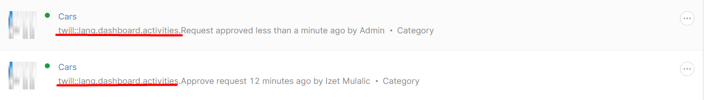
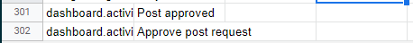
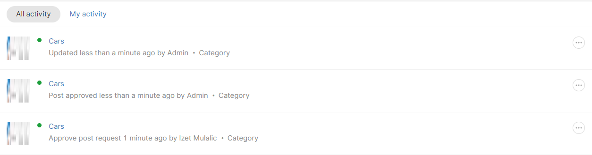

As of Twill 2.9.0 version [release](https://github.com/area17/twill/releases/tag/2.9.0) we are introduced with a new method that allows us to overwrite some of the sidebar button action on different states (draft, live, update).

So in this example, we will try to build approve system with Admin - Publisher relation.

Firstly let's override the form to prevent the Publisher role from accessing the main feature - changing post from draft to live and reverse without Admin approval.

```php

namespace App\Http\Controllers\Admin;

use A17\Twill\Http\Controllers\Admin\ModuleController as BaseModuleController;

class CategoryController extends BaseModuleController
{
    protected $moduleName = 'categories';

    public function getSubmitOptions($item): ?array
    {

        $options = $data = parent::getSubmitOptions($item);

        // Unset update key
        unset($options['live']);

        // Add data to the live key which will contain our own display logic per role
        $options['live'] = in_array(\Auth::guard('twill_users')->user()->role, ['SUPERADMIN', 'ADMIN']) ?
                        [   
                            ...$data['live'],
                            [
                                'name' => 'approve_notify',
                                'text' => 'Publish and notify', 
                            ], 
                        ] : 
                        [
                            [
                                'name' => 'approve',
                                'text' => 'Request approve',
                            ]
                        ];

        return $options;
                       
    }
}
```

Also, Publishers can also publish that record from the index list so let's restrict that to all CMS users.

```php
// ./app/Http/Controllers/Admin/CategoryController.php

protected $indexOptions = [
    'publish' => false
];
```

One more thing is to refresh page after success so Publisher cant do any actions after requested approve.

```php
// ./app/Http/Controllers/Admin/CategoryController.php 

/*
* Add anything you would like to have available in your module's form view
* For example, relationship lists for multiselect form fields
*/
protected function formData($request)
{
    return [
        'reloadOnSuccess' => true
    ];
}
```

Let's hook onto these actions from the front end.

```php
// ./app/Http/Controllers/Admin/CategoryController.php

/**
 * @param int $id
 * @param int|null $submoduleId
 * @return \Illuminate\Http\JsonResponse
 */
public function update($id, $submoduleId = null)
{
    //Let's check if actions are submitted
    $params = $this->request->route()->parameters();
    $id = last($params);
    $item = $this->repository->getById($id);
    $input = $this->request->all();


    // Check if the publisher submitted approve request
    if (isset($input['cmsSaveType']) && $input['cmsSaveType'] === 'approve') {

        // Here for now we will just use the activity log, you can implement email notification here or something else
        activity()->performedOn($item)->log('requested-approve');

        // Return success response, don't proceed otherwise it will publish it automatically
        return $this->respondWithSuccess('Approve request submitted! Please wait for the administration to approve it.');
    }

    // Check if admin approved submit request 
    if (isset($input['cmsSaveType']) && $input['cmsSaveType'] === 'approve_notify') {

        // Here for now we will just use the activity log, you can implement email send here or something else
        activity()->performedOn($item)->log('approved');

        // Overwrite our current save type with a default Twill action
        $this->request->merge([
            'cmsSaveType' => 'update'
        ]);
    }

    return parent::update($id, $submoduleId);
}

```

  

After we test we can see that dashboard activity contains our actions.


But we can notice that Twill has default translations for those actions so let's fix that.

There is no really easy way to achieve this, so we will stick with the easiest one - langs.

Let's export lang.csv and add our activity keys.
Import it to the Google Sheets and add new keys with translated values.



Let's import it to the Twill langs (`vendor/area17/twill/langs/`).
Run the artisan command to regenerate lang files.

```sh
$ php artisan twill:lang
```

So that sums, this up, let's check the final result.




### Conclusion
This is not the most-wanted scenario, but it does a simple job. From Twill's perspective, this can be improved a lot, I'm sure of it.

Leave a :star: on the project to support this open-source project! [Twill](https://github.com/area17/twill)

`Let's` counter: 8


